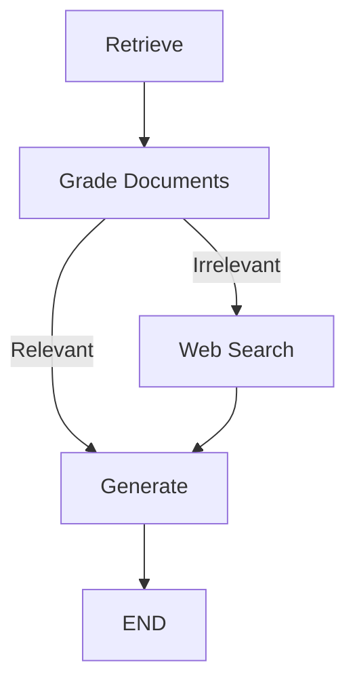

# Corrective Retrieval-Augmented Generation (C-RAG)

🚀 **C-RAG** is an implementation of the *Corrective Retrieval-Augmented Generation* (C-RAG) workflow, inspired by the paper [Corrective Retrieval Augmented Generation (2024)](https://arxiv.org/pdf/2401.15884).  
It intelligently **retrieves**, **grades**, and **generates** high-quality answers by correcting irrelevant retrieved information via web search if necessary.

---

## 📚 Table of Contents

- [About the Project](#about-the-project)
- [Architecture](#architecture)
- [Technologies Used](#technologies-used)
- [Installation](#installation)
- [Usage](#usage)
- [Project Structure](#project-structure)
- [Future Work](#future-work)
- [Acknowledgements](#acknowledgements)

---

## 📖 About the Project

Traditional Retrieval-Augmented Generation (RAG) systems sometimes retrieve **irrelevant documents**, leading to poor generation quality.

**C-RAG** enhances this process by:
- **Grading** retrieved documents for relevance.
- **Performing web search** if necessary to correct irrelevant retrievals.
- **Generating** a final answer based on the corrected knowledge base.

Additionally, this project uses a **vector store (ChromaDB)** for document storage and retrieval.

---

## 🧠 Architecture

The project builds a **graph workflow** consisting of the following nodes:

- **Retrieve** → Fetch documents from a vector database (ChromaDB).
- **Grade Documents** → Grade each document for relevance (binary yes/no).
- **Decision** → If documents are irrelevant, trigger **Web Search**; else directly **Generate**.
- **Web Search** → Perform search using **Tavily API** for updated documents.
- **Generate** → Generate a final response using the most relevant documents.



🖼️ (Graph diagram generated automatically as `graph.png`)

---

## ⚙️ Technologies Used

- **Python 3.10+**
- **LangChain** (Core, Graph, Hub)
- **ChromaDB** (Vector database)
- **OpenAI GPT-4.1-nano** (for text generation)
- **Google Gemini 2.0 Flash** (for document grading)
- **Tavily Search API** (for fallback web search)

---

## 🔥 Installation

1. **Clone the repository**

```bash
git clone https://github.com/RAHULREDDYYSR/C_RAG.git
cd C_RAG
```

2. **Install dependencies**

```bash
pipenv install 
```

3. **Environment Variables**

Create a `.env` file with your API keys:

```env
OPENAI_API_KEY=your-openai-api-key
TAVILY_API_KEY=your-tavily-api-key
GOOGLE_API_KEY=your-google-api-key
```

4. **Run the ingestion (optional first-time)**

If you don't have the Chroma vector store ready, you can run:

```bash
python ingestion.py
```

This will download, split, embed, and store documents in local ChromaDB.

5. **Run the main program**

```bash
python main.py
```

---

## 🚀 Usage

When you run `main.py`, the flow will:

- Retrieve documents from ChromaDB.
- Grade them for relevance.
- Perform corrective web search if needed.
- Generate a final answer.

Example console output:

```
===========C_RAG================
============RETRIEVE================
========CHECK DOCUMENT RELEVANCE TO QUESTION=============
============ASSESS GRADED DOCUMENTS===============
===============decision: GENERATE====================
============GENERATE==============
Generated Answer: "Agent memory refers to..."
```

---

## 🗂️ Project Structure

```
C_RAG/
 ├── graph/
 │    ├── chains/
 │    │    ├── generation.py        # LLM chain for generation
 │    │    └── retrieval_grader.py   # Grading chain
 │    ├── nodes/
 │    │    ├── generate.py           # Generation node
 │    │    ├── grade_documents.py    # Document grading node
 │    │    ├── retrieve.py           # Retrieval node
 │    │    └── websearch.py          # Web search node
 │    ├── consts.py                  # Node name constants
 │    ├── state.py                   # Graph state structure
 │    └── graph.py                   # Graph workflow setup
 ├── ingestion.py                    # Ingest and persist documents into Chroma
 ├── main.py                         # Entry point
 ├── .env                            # Environment variables (not committed)
 ├── Pipfile                         # Python dependencies
 └── graph.png                       # (Generated) graph visualization
```

---

## 🚀 Future Work

- Add multi-hop retrieval and reasoning.
- Introduce Reranking models (reorder retrieved documents).
- Integrate with streaming UI (like Streamlit or Gradio).

---

## 🙏 Acknowledgements

- [Corrective Retrieval-Augmented Generation (Paper, 2024)](https://arxiv.org/pdf/2401.15884)
- [LangChain](https://www.langchain.dev/)
- [Chroma](https://docs.trychroma.com/)
- [Tavily Search API](https://www.tavily.com/)

---

## ✨ Author

- **Rahul Y S** — [@RAHULREDDYYSR](https://github.com/RAHULREDDYYSR)

---

> ⭐ If you find this project useful, consider giving it a star on GitHub!
