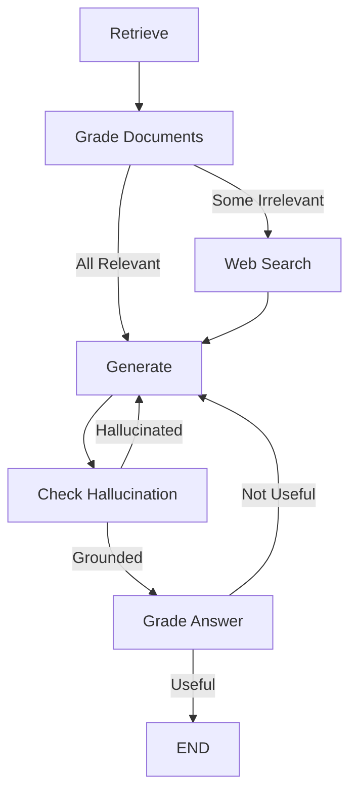

# Self-Reflective Retrieval-Augmented Generation (Self-RAG)

🚀 **Self-RAG** is an advanced implementation of *Self-Reflective Retrieval-Augmented Generation* using **LangGraph**, inspired by the paper [Self-RAG: Learning to Retrieve, Generate, and Critique through Self-Reflection (2023)](https://arxiv.org/abs/2310.11511).  

This system goes beyond traditional RAG by implementing **self-reflection** mechanisms that intelligently **retrieve**, **grade**, **generate**, and **critique** answers through multiple validation layers including hallucination detection and answer quality assessment.

---

## 📚 Table of Contents

- [About the Project](#about-the-project)
- [Architecture](#architecture)
- [Technologies Used](#technologies-used)
- [Installation](#installation)
- [Usage](#usage)
- [Project Structure](#project-structure)
- [Future Work](#future-work)
- [Acknowledgements](#acknowledgements)

---

## 📖 About the Project

Traditional Retrieval-Augmented Generation (RAG) systems sometimes retrieve **irrelevant documents** and may generate **hallucinated** or **low-quality answers**.

**Self-RAG** enhances this process through self-reflection by:
- **Grading** retrieved documents for relevance to the question
- **Performing web search** if necessary to correct irrelevant retrievals
- **Generating** answers based on the most relevant information
- **Checking for hallucinations** to ensure answers are grounded in retrieved facts
- **Validating answer quality** to confirm the response addresses the user's question

Additionally, this project uses **ChromaDB** for vector storage and retrieval, **LangGraph** for workflow orchestration, and provides an interactive **Gradio web interface**.

---

## 🧠 Architecture

The project builds a **LangGraph workflow** with self-reflective capabilities consisting of the following nodes:

- **Retrieve** → Fetch relevant documents from ChromaDB vector database
- **Grade Documents** → Self-reflect on each document's relevance (binary yes/no)
- **Decision** → Route to Web Search if documents are irrelevant, else proceed to Generate
- **Web Search** → Perform fallback search using **Tavily API** for additional context
- **Generate** → Create answer using the most relevant documents
- **Check Hallucination** → Validate that the generated answer is grounded in retrieved facts
- **Grade Answer** → Ensure the answer properly addresses the user's question



🖼️ (Graph diagram can be generated automatically)

---

## ⚙️ Technologies Used

- **Python 3.13+**
- **LangGraph** - Graph-based workflow orchestration
- **LangChain** - Core libraries and integrations
- **ChromaDB** - Vector database for document storage
- **OpenAI GPT-4o-mini** - For text generation and grading
- **Tavily Search API** - For fallback web search
- **Gradio** - Interactive web interface
- **UV** - Fast Python package manager

---

## 🔧 Setup Instructions

### 1. Clone the Repository

```bash
git clone https://github.com/RAHULREDDYYSR/SELF-RAG.git
cd SELF-RAG
```

### 2. Install UV Package Manager

UV is a fast Python package manager. Install it first:

```bash
# On Windows (PowerShell)
powershell -c "irm https://astral.sh/uv/install.ps1 | iex"

# On macOS/Linux
curl -LsSf https://astral.sh/uv/install.sh | sh
```

### 3. Install Dependencies

```bash
uv sync
```

### 4. Set Up Environment Variables

Create a `.env` file in the root directory:

```env
OPENAI_API_KEY=your_openai_api_key_here
TAVILY_API_KEY=your_tavily_api_key_here
```

### 5. Ingest Documents into ChromaDB

The project comes with pre-configured URLs for ingestion. Run:

```bash
uv run python ingestion.py
```

This will download, chunk, embed, and store documents in ChromaDB.

### 6. Run the Application

#### Option A: Interactive Gradio Web Interface (Recommended)

```bash
uv run python gradio_app.py
```

Then open your browser to `http://localhost:7860`

#### Option B: Command Line Interface

```bash
uv run python main.py
```

---

## 🚀 Usage

### Gradio Web Interface

The Gradio interface provides an interactive chat-based experience:

1. **Ask Questions**: Type any question in the chat interface
2. **View Workflow**: See the Self-RAG workflow in action with detailed logging
3. **Review Documents**: Examine which documents were retrieved and deemed relevant
4. **Track Web Search**: See when the system triggers web search for additional context

Example questions:
- "What is LCEL?"
- "What is agent memory?"
- "Explain retrieval-augmented generation"

### Command Line Interface

When you run `main.py`, the workflow will:

- Retrieve documents from ChromaDB
- Grade them for relevance
- Perform corrective web search if needed
- Generate a final answer
- Check for hallucinations
- Validate answer quality

Example console output:

```
⬇️ Retrieving documents...
🔍 CHECK DOCUMENT RELEVANCE TO QUESTION...
GRADE: ❌ DOCUMENT NOT RELEVANT 
GRADE: ✅ DOCUMENT RELEVANT
🔍 ASSESS GRADED DOCUMENTS...
DECISION: ⭕ NOT ALL DOCUMENTS ARE RELEVANT TO QUESTION, INCLUDE WEB_SEARCH
🔍 Searching web for relevant documents...
🤖 Generating...
🔍 CHECK HALLUCINATION...
✅ DECISION: GENERATION IS GROUNDED IN DOCUMENTS
🔍 GRADE GENERATION VS QUESTION...
✅ GRADE: GENERATION IS ANSWER TO QUESTION
```

---

## 🗂️ Project Structure

```
SELF_RAG/
 ├── graph/
 │    ├── chains/
 │    │    ├── __init__.py
 │    │    ├── generation.py           # LLM chain for answer generation
 │    │    ├── retrieval_grader.py     # Document relevance grading chain
 │    │    ├── hallucination_grader.py # Hallucination detection chain
 │    │    └── answer_grader.py        # Answer quality grading chain
 │    ├── nodes/
 │    │    ├── __init__.py
 │    │    ├── generate.py             # Generation node with self-reflection
 │    │    ├── grade_documents.py      # Document grading node
 │    │    ├── retrieve.py             # Retrieval node
 │    │    └── web_search.py           # Web search node
 │    ├── __init__.py
 │    ├── consts.py                    # Node name constants
 │    ├── state.py                     # LangGraph state structure
 │    └── graph.py                     # LangGraph workflow definition
 ├── gradio_app.py                     # Gradio web interface
 ├── main.py                           # CLI entry point
 ├── ingestion.py                      # Document ingestion script
 ├── .env                              # Environment variables (not committed)
 ├── pyproject.toml                    # UV project configuration
 ├── uv.lock                           # UV lock file
 └── langgraph.json                    # LangGraph configuration
```

---

## 🚀 Future Work

- **Advanced Retrieval**: Implement multi-hop reasoning and query decomposition
- **Reranking Models**: Add reranking layer to improve document ordering
- **Customizable LLMs**: Support for multiple LLM providers (Anthropic, Cohere, etc.)
- **Streaming Responses**: Real-time streaming of generated answers in Gradio
- **Evaluation Metrics**: Add automated evaluation with RAGAS or similar frameworks
- **Prompt Optimization**: Fine-tune prompts for better grading accuracy
- **Caching Layer**: Implement semantic caching to reduce API calls

---

## 🙏 Acknowledgements

- [Self-RAG: Learning to Retrieve, Generate, and Critique through Self-Reflection (Paper, 2023)](https://arxiv.org/abs/2310.11511)
- [LangGraph Documentation](https://langchain-ai.github.io/langgraph/)
- [LangChain Documentation](https://www.langchain.dev/)
- [ChromaDB Documentation](https://docs.trychroma.com/)
- [Tavily Search API](https://www.tavily.com/)
- [Gradio Documentation](https://www.gradio.app/)

---

## ✨ Author

- **Rahul Y S** — [@RAHULREDDYYSR](https://github.com/RAHULREDDYYSR)

---

> ⭐ If you find this project useful, consider giving it a star on GitHub!
