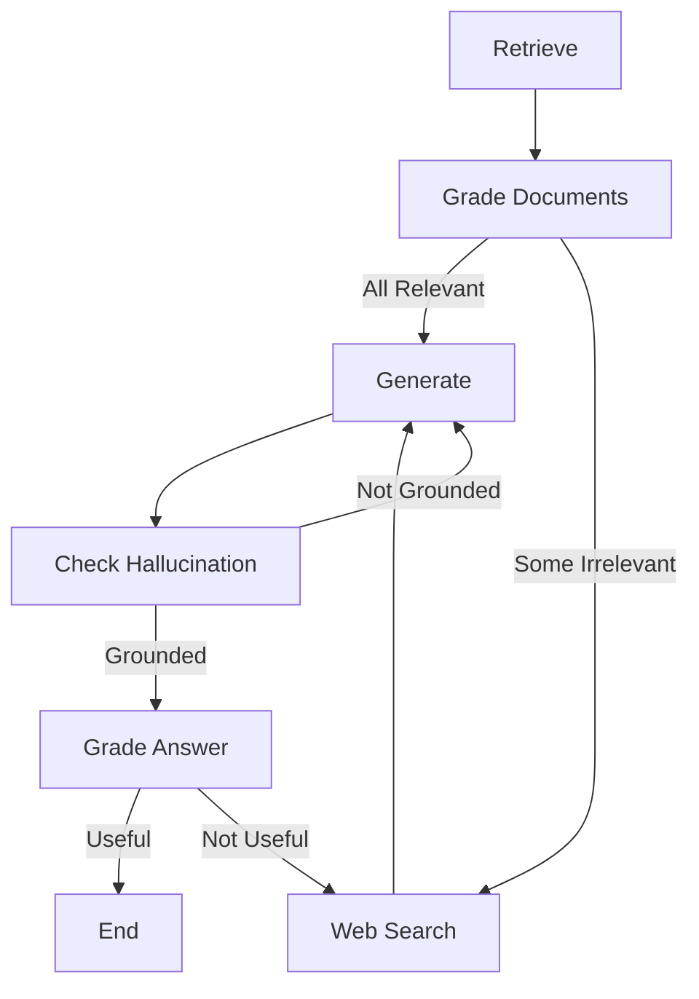

# 🧠 SELF-RAG

[](https://www.python.org/)
[](https://langchain-ai.github.io/langgraph/)
[](https://www.gradio.app/)
[](https://docs.astral.sh/uv/)

Self-Reflective RAG implementation built with **LangGraph + LangChain + ChromaDB**.
It retrieves context, grades relevance, generates an answer, checks grounding, and can trigger web search correction when needed.

---

## ✨ Why this project?

Traditional RAG can fail when retrieval is weak. SELF-RAG adds a reflection loop:

- **Retrieve** relevant chunks
- **Grade** each retrieved document
- **Correct** with web search (Tavily) when needed
- **Generate** grounded answers
- **Validate** hallucination risk and answer quality

---

## 🏗️ Workflow


```mermaid
flowchart TD
    A[Retrieve] --> B[Grade Documents]
    B -->|All Relevant| D[Generate]
    B -->|Some Irrelevant| C[Web Search]
    C --> D
    D --> E[Check Hallucination]
    E -->|Grounded| F[Grade Answer]
    E -->|Not Grounded| D
    F -->|Useful| G[End]
    F -->|Not Useful| C
```

---

## 🧰 Tech Stack

- Python 3.13+
- LangGraph
- LangChain
- ChromaDB
- OpenAI models (configured in chains)
- Tavily Search API
- Gradio

---

## ⚡ Quickstart

### 1) Clone

```bash
git clone https://github.com/RAHULREDDYYSR/SELF-RAG.git
cd SELF-RAG
```

### 2) Install dependencies

```bash
uv sync
```

### 3) Configure environment

Create a `.env` file in the project root:

```env
OPENAI_API_KEY=your_openai_api_key
TAVILY_API_KEY=your_tavily_api_key
```

### 4) Build local vector store

```bash
uv run python ingestion.py
```

This creates/uses `./.chroma` inside the repo.

### 5) Run

**Gradio UI (recommended)**

```bash
uv run python gradio_app.py
```

Open: `http://localhost:7860`

**CLI**

```bash
uv run python main.py
```

---

## 💬 Example prompts

- `What is LCEL?`
- `What are the components of autonomous agents?`
- `Explain Chain of Thought prompting.`

---

## 🗂️ Project structure

```text
SELF-RAG/
├── graph/
│   ├── chains/          # LLM chains: generation + graders
│   ├── nodes/           # Graph node implementations
│   ├── consts.py
│   ├── state.py
│   └── graph.py         # LangGraph workflow definition
├── ingestion.py         # Loads, chunks, embeds, stores docs in Chroma
├── gradio_app.py        # Web UI
├── main.py              # CLI run
├── langgraph.json       # LangGraph config
├── pyproject.toml
└── uv.lock
```

---

## ✅ Testing

```bash
uv run pytest
```

> Tests rely on configured API keys and accessible model providers.

---

## 🧪 Troubleshooting

- **`OPENAI_API_KEY` missing** → add it to `.env`.
- **`TAVILY_API_KEY` missing** → required for web-search correction path.
- **No docs retrieved** → run `uv run python ingestion.py` again to build `.chroma`.

---

## 🛣️ Roadmap

- Better retrieval/reranking
- Multi-provider LLM support
- Response streaming in UI
- Evaluation benchmark integration
- Caching and latency optimizations

---

## 🤝 Contributing

Contributions are welcome. Open an issue or submit a PR with clear context and reproducible steps.

---

## 🙏 Acknowledgements

- [Self-RAG Paper (2023)](https://arxiv.org/abs/2310.11511)
- [LangGraph Docs](https://langchain-ai.github.io/langgraph/)
- [LangChain Docs](https://www.langchain.dev/)
- [Chroma Docs](https://docs.trychroma.com/)
- [Tavily](https://www.tavily.com/)
- [Gradio](https://www.gradio.app/)

---

## 👤 Author

**Rahul Y S** — [@RAHULREDDYYSR](https://github.com/RAHULREDDYYSR)

If this helped, consider giving the repo a ⭐
