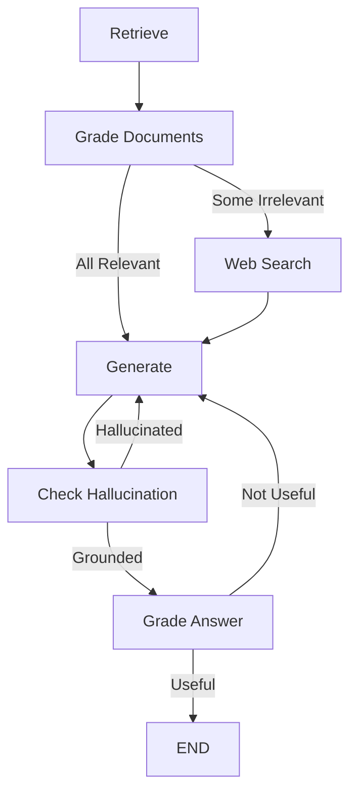
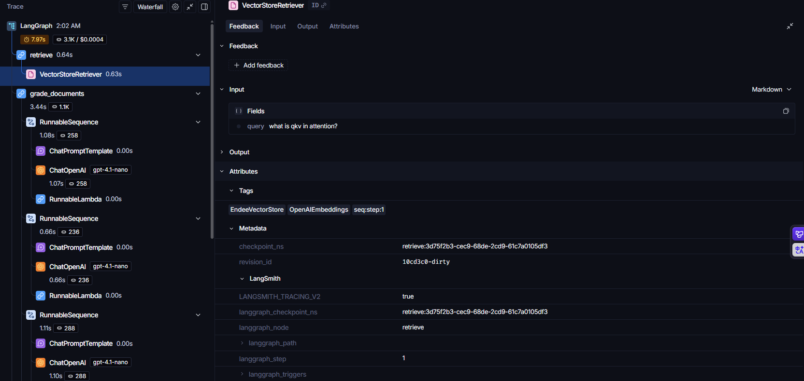
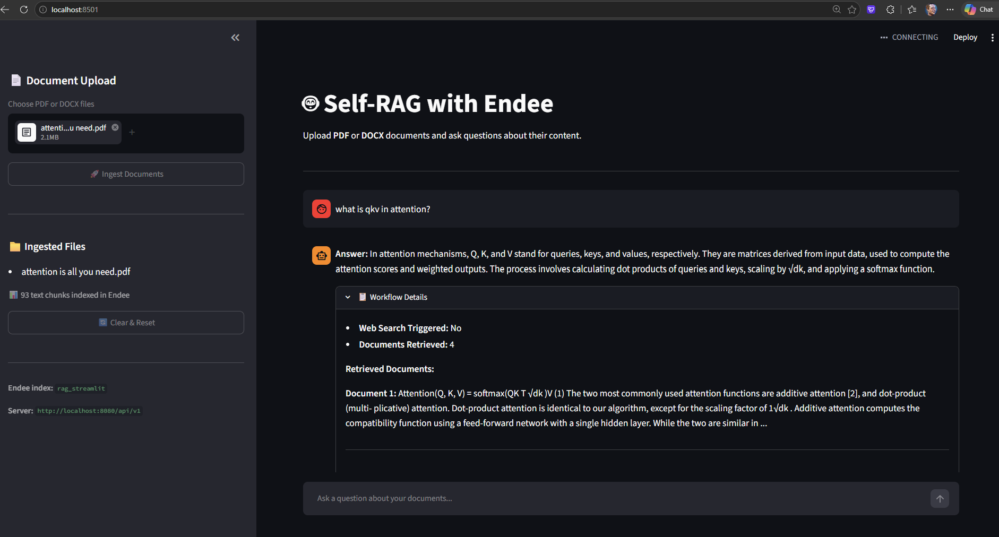

# Self-Reflective Retrieval-Augmented Generation (Self-RAG)

🚀 **Self-RAG** is an advanced implementation of *Self-Reflective Retrieval-Augmented Generation* using **LangGraph**, inspired by the paper [Self-RAG: Learning to Retrieve, Generate, and Critique through Self-Reflection (2023)](https://arxiv.org/abs/2310.11511).  

This system goes beyond traditional RAG by implementing **self-reflection** mechanisms that intelligently **retrieve**, **grade**, **generate**, and **critique** answers through multiple validation layers including hallucination detection and answer quality assessment.

---

## 📚 Table of Contents

- [About the Project](#about-the-project)
- [Architecture](#architecture)
- [Technologies Used](#technologies-used)
- [Installation](#installation)
- [Usage](#usage)
- [Endee Vector Database](#endee-vector-database)
- [Project Structure](#project-structure)
- [Future Work](#future-work)
- [Acknowledgements](#acknowledgements)

---

## 📖 About the Project

Traditional Retrieval-Augmented Generation (RAG) systems sometimes retrieve **irrelevant documents** and may generate **hallucinated** or **low-quality answers**.

**Self-RAG** enhances this process through self-reflection by:
- **Grading** retrieved documents for relevance to the question
- **Performing web search** if necessary to correct irrelevant retrievals
- **Generating** answers based on the most relevant information
- **Checking for hallucinations** to ensure answers are grounded in retrieved facts
- **Validating answer quality** to confirm the response addresses the user's question

This project supports **two vector databases**:

- **ChromaDB** — the default vector store for the original CLI and Gradio apps
- **Endee** — a lightweight, self-hosted vector database alternative in dedicated apps

Additional tooling includes **LangGraph** for workflow orchestration, **Gradio** for web interfaces, and **Streamlit** for an interactive document-upload experience.

---

## 🧠 Architecture

The project builds a **LangGraph workflow** with self-reflective capabilities consisting of the following nodes:

- **Retrieve** → Fetch relevant documents from ChromaDB or Endee vector database
- **Grade Documents** → Self-reflect on each document's relevance (binary yes/no)
- **Decision** → Route to Web Search if documents are irrelevant, else proceed to Generate
- **Web Search** → Perform fallback search using **Tavily API** for additional context
- **Generate** → Create answer using the most relevant documents
- **Check Hallucination** → Validate that the generated answer is grounded in retrieved facts
- **Grade Answer** → Ensure the answer properly addresses the user's question


```mermaid
flowchart TD
    A[Retrieve] --> B[Grade Documents]
    B -->|All Relevant| D[Generate]
    B -->|Some Irrelevant| C[Web Search]
    C --> D
    D --> E[Check Hallucination]
    E -->|Grounded| F[Grade Answer]
    E -->|Hallucinated| D
    F -->|Useful| G[END]
    F -->|Not Useful| D
```



---

## ⚙️ Technologies Used

- **Python 3.13+**
- **LangGraph** - Graph-based workflow orchestration
- **LangChain** - Core libraries and integrations
- **ChromaDB** - Vector database for document storage (default)
- **Endee** - Lightweight self-hosted vector database (alternative)
- **OpenAI GPT-4.1-nano** - For text generation and grading
- **Tavily Search API** - For fallback web search
- **Gradio** - Interactive web interface
- **Streamlit** - Interactive web interface with runtime file upload
- **UV** - Fast Python package manager

---

## 🔧 Setup Instructions

### 1. Clone the Repository

```bash
git clone https://github.com/RAHULREDDYYSR/SELF-RAG.git
cd SELF-RAG
```

### 2. Install UV Package Manager

UV is a fast Python package manager. Install it first:

```bash
# On Windows (PowerShell)
powershell -c "irm https://astral.sh/uv/install.ps1 | iex"

# On macOS/Linux
curl -LsSf https://astral.sh/uv/install.sh | sh
```

### 3. Install Dependencies

```bash
uv sync
```

### 4. Set Up Environment Variables

Create a `.env` file in the root directory:

```env
OPENAI_API_KEY=your_openai_api_key_here
TAVILY_API_KEY=your_tavily_api_key_here
ENDEE_BASE_URL=http://localhost:8080/api/v1
```

### 5. Start Endee (Optional — for Endee-based apps)

Endee is a lightweight, self-hosted vector database that runs in Docker without requiring an API key:

```bash
mkdir -p ~/endee-data
docker run -d --name endee-server \
  -p 8080:8080 \
  -v ~/endee-data:/data \
  endeeio/endee-server:latest
```

### 6. Ingest Documents

#### Option A: ChromaDB (for CLI and default Gradio app)

```bash
uv run python ingestion.py
```

This will download, chunk, embed, and store documents in ChromaDB.

#### Option B: Endee (for Endee-based Gradio and Streamlit apps)

```bash
uv run python ingestion_endee.py
```

### 7. Run the Application

#### Option A: Gradio Web Interface (ChromaDB)

```bash
uv run python gradio_app.py
```

Then open your browser to `http://localhost:7860`

#### Option B: Gradio Web Interface (Endee)

```bash
uv run python gradio_app_endee.py
```

Then open your browser to `http://localhost:7861`

#### Option C: Streamlit Web Interface (Endee, with Runtime File Upload)

```bash
uv run streamlit run streamlit_app.py
```

This app lets you upload PDF/DOCX files at runtime and ask questions about them.

#### Option D: Command Line Interface

```bash
uv run python main.py
```

---

## 🚀 Usage

### Gradio Web Interface (ChromaDB)

The Gradio interface provides an interactive chat-based experience:

1. **Ask Questions**: Type any question in the chat interface
2. **View Workflow**: See the Self-RAG workflow in action with detailed logging
3. **Review Documents**: Examine which documents were retrieved and deemed relevant
4. **Track Web Search**: See when the system triggers web search for additional context

Example questions:
- "What is LCEL?"
- "What is agent memory?"
- "Explain retrieval-augmented generation"

### Gradio Web Interface (Endee)

Same interactive experience backed by the Endee vector database. Run on port `7861`.

### Streamlit Web Interface (Endee)

A runtime document Q&A app:
1. **Upload** PDF or DOCX files in the sidebar
2. **Ingest** them into Endee's vector index
3. **Ask** questions about the uploaded content
4. **View** the full Self-RAG workflow breakdown (retrieved docs, relevance grading, web search triggers)



### Command Line Interface

When you run `main.py`, the workflow will:

- Retrieve documents from ChromaDB
- Grade them for relevance
- Perform corrective web search if needed
- Generate a final answer
- Check for hallucinations
- Validate answer quality

Example console output:

```
⬇️ Retrieving documents...
🔍 CHECK DOCUMENT RELEVANCE TO QUESTION...
GRADE: ❌ DOCUMENT NOT RELEVANT 
GRADE: ✅ DOCUMENT RELEVANT
🔍 ASSESS GRADED DOCUMENTS...
DECISION: ⭕ NOT ALL DOCUMENTS ARE RELEVANT TO QUESTION, INCLUDE WEB_SEARCH
🔍 Searching web for relevant documents...
🤖 Generating...
🔍 CHECK HALLUCINATION...
✅ DECISION: GENERATION IS GROUNDED IN DOCUMENTS
🔍 GRADE GENERATION VS QUESTION...
✅ GRADE: GENERATION IS ANSWER TO QUESTION
```

---

## 🗄️ Endee Vector Database

### Overview

[Endee](https://endee.io/) is a lightweight, self-hosted vector database designed for AI applications. Unlike cloud-dependent solutions, Endee runs locally via Docker with no API key required.

### Why Endee?

| Feature | Endee | ChromaDB |
|---|---|---|
| **Hosting** | Self-hosted (Docker) | Embedded / self-hosted |
| **API Key** | Not required | Not required |
| **Deployment** | Single Docker container | Python library in-process |
| **Persistence** | Disk-backed (`/data` volume) | In-memory / on-disk |
| **Performance** | High-performance vector search | Good for small-medium datasets |
| **Protocol** | HTTP REST API | In-process function calls |

### Use Cases

- **Local & Offline Document Search** — Fully self-contained; no external API calls for vector storage
- **Privacy-Sensitive Applications** — All document embeddings stay on your machine behind Docker
- **Rapid Prototyping** — Minimal setup: one `docker run` command and you're ready to go
- **CI/CD Pipelines** — Easy to spin up in test environments without provisioning cloud resources
- **Edge Deployments** — Lightweight enough to run on modest hardware

### Advantages

- **No API key needed** — Zero cloud dependencies for vector storage
- **Simple Docker deployment** — Single command to start the server
- **LangChain-native** — Integrated via `langchain-endee` package with the same API as other vector stores
- **Low latency** — HTTP-based REST API with fast vector search
- **Multiple precision modes** — Supports `int8` and `float32` precision for memory/accuracy trade-offs
- **Configurable distance metrics** — Supports cosine, dot product, and Euclidean distance

### Apps Using Endee

| App | Description | Command |
|---|---|---|
| `gradio_app_endee.py` | Gradio chat interface (port 7861) | `uv run python gradio_app_endee.py` |
| `streamlit_app.py` | Streamlit app with runtime file upload | `uv run streamlit run streamlit_app.py` |
| `ingestion_endee.py` | Ingest blog URLs into Endee | `uv run python ingestion_endee.py` |

---

## 🗂️ Project Structure

```
SELF_RAG/
 ├── graph/
 │    ├── chains/
 │    │    ├── __init__.py
 │    │    ├── generation.py           # LLM chain for answer generation
 │    │    ├── retrieval_grader.py     # Document relevance grading chain
 │    │    ├── hallucination_grader.py # Hallucination detection chain
 │    │    └── answer_grader.py        # Answer quality grading chain
 │    ├── nodes/
 │    │    ├── __init__.py
 │    │    ├── generate.py             # Generation node with self-reflection
 │    │    ├── grade_documents.py      # Document grading node
 │    │    ├── retrieve.py             # Retrieval node
 │    │    └── web_search.py           # Web search node
 │    ├── __init__.py
 │    ├── consts.py                    # Node name constants
 │    ├── state.py                     # LangGraph state structure
 │    └── graph.py                     # LangGraph workflow definition
 ├── gradio_app.py                     # Gradio web interface (ChromaDB, port 7860)
 ├── gradio_app_endee.py               # Gradio web interface (Endee, port 7861)
 ├── streamlit_app.py                  # Streamlit web interface (Endee, runtime file upload)
 ├── main.py                           # CLI entry point
 ├── ingestion.py                      # Document ingestion script (ChromaDB)
 ├── ingestion_endee.py                # Document ingestion script (Endee)
 ├── .env                              # Environment variables (not committed)
 ├── pyproject.toml                    # UV project configuration
 ├── uv.lock                           # UV lock file
 └── langgraph.json                    # LangGraph configuration
```

---

## 🚀 Future Work

- **Advanced Retrieval**: Implement multi-hop reasoning and query decomposition
- **Reranking Models**: Add reranking layer to improve document ordering
- **Customizable LLMs**: Support for multiple LLM providers (Anthropic, Cohere, etc.)
- **Streaming Responses**: Real-time streaming of generated answers in Gradio
- **Evaluation Metrics**: Add automated evaluation with RAGAS or similar frameworks
- **Prompt Optimization**: Fine-tune prompts for better grading accuracy
- **Caching Layer**: Implement semantic caching to reduce API calls
- **Endee Hybrid Search**: Leverage Endee's hybrid (dense + sparse) search capabilities
- **Multi-Index Routing**: Route queries to different Endee indexes based on topic

---

## 🙏 Acknowledgements

- [Self-RAG: Learning to Retrieve, Generate, and Critique through Self-Reflection (Paper, 2023)](https://arxiv.org/abs/2310.11511)
- [LangGraph Documentation](https://langchain-ai.github.io/langgraph/)
- [LangChain Documentation](https://www.langchain.dev/)
- [ChromaDB Documentation](https://docs.trychroma.com/)
- [Endee Documentation](https://endee.io/docs)
- [Tavily Search API](https://www.tavily.com/)
- [Gradio Documentation](https://www.gradio.app/)
- [Streamlit Documentation](https://docs.streamlit.io/)

---

## ✨ Author

- **Rahul Y S** — [@RAHULREDDYYSR](https://github.com/RAHULREDDYYSR)

---

> ⭐ If you find this project useful, consider giving it a star on GitHub!
