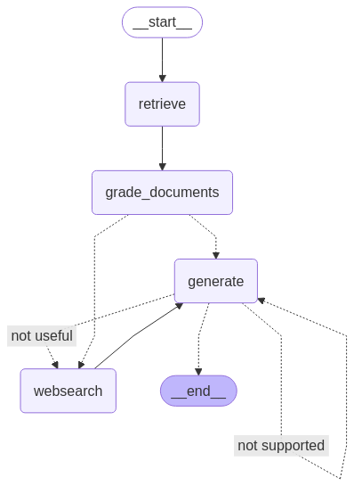

# SELF\_RAG: Self-Reflective Retrieval-Augmented Generation

**SELF\_RAG** is a self-evaluating Retrieval-Augmented Generation (RAG) system inspired by the paper [Reflexion: Language Agents with Verbal Reinforcement Learning](https://arxiv.org/pdf/2310.11511). It extends the standard RAG pipeline with multiple grading stages that assess the relevance, accuracy, and hallucination level of generated answers, allowing the system to refine and improve its own output.

---

## 📁 Project Structure

```bash
SELF_RAG/
│
├── .chroma/                     # ChromaDB vector store
├── graph/
│   ├── chains/
│   │   ├── tests/
│   │   │   ├── __init__.py
│   │   │   ├── answer_grader.py         # Grades the generated answer against the original question
│   │   │   ├── generation.py            # Generation step
│   │   │   ├── hallucination_grader.py # Grades grounding of generation in retrieved docs
│   │   │   └── retrieval_grader.py     # Grades doc relevance to input question
│   ├── nodes/
│   │   ├── __init__.py
│   │   ├── consts.py                    # Constants used across the graph
│   │   ├── graph.py                     # LangGraph graph definition
│   │   └── state.py                     # Shared state definition for LangGraph
│   └── __init__.py
│
├── ingestion.py                 # Script to ingest and embed documents into ChromaDB
├── main.py                      # Entry point to run the SELF_RAG pipeline
├── graph.png                    # Architecture diagram of the graph flow
├── .env                         # Environment variables (e.g., API keys)
├── .gitignore
├── Pipfile                      # Dependency management
├── Pipfile.lock
└── README.md                    # You're here!
```

---

## 🧠 How It Works

SELF\_RAG follows a multi-stage decision-making process using LangGraph. The pipeline includes:

1. **Document Retrieval**

   * Uses embedded document chunks stored in ChromaDB.
   * Filters top-k relevant documents.

2. **Relevance Grading**

   * Each document is evaluated for relevance to the user’s query using a relevance grader.

3. **Answer Generation**

   * A response is generated based on the top-ranked relevant documents.

4. **Hallucination Grading**

   * Assesses if the generated answer is well-grounded in the retrieved documents.

5. **Answer Grading**

   * Evaluates the generated answer’s quality and correctness in relation to the original question.

6. **Decision Making**

   * If the answer lacks grounding or is inaccurate, the system attempts regeneration.

---

## ✅ Example Output (Terminal)

```bash
$ python main.py
Data_Directory doesn't exist, creating one...
Done!
Self_RAG in work...
📄 Retrieving documents...
🔍 CHECK DOCUMENT RELEVANCE TO QUESTION...
✅ GRADE: DOCUMENT(1) RELEVANT
✅ GRADE: DOCUMENT(2) RELEVANT
✅ GRADE: DOCUMENT(3) RELEVANT
✅ GRADE: DOCUMENT(4) RELEVANT
✅ FINISHED CHECKING DOCUMENT RELEVANCE TO QUESTION...
🧠 ASSESS GRADED DOCUMENTS...
🟢 DECISION: GENERATE...
⚙️  Generating...
🤖 CHECK HALLUCINATION...
🟢 DECISION: GENERATION IS GROUNDED IN DOCUMENTS
✅ GRADE GENERATION VS QUESTION...
✅ GRADE: GENERATION IS ANSWER TO QUESTION

{
  "question": "what is agent memory",
  "generation": "Agent memory refers to the mechanisms by which a large language model (LLM)-powered agent retains and recalls information...",
  "web_search": false,
  "documents": [...],
  "source": "https://lilianweng.github.io/posts/2023-06-23-agent/",
  "title": "LLM Powered Autonomous Agents | Lil’Log"
}
```

---

## 🔧 Setup Instructions

### 1. Clone the Repository

```bash
git clone https://github.com/your-username/SELF_RAG.git
cd SELF_RAG
```

### 2. Install Dependencies

```bash
pip install pipenv
pipenv install
```

### 3. Set Up Environment Variables

Create a `.env` file in the root directory:

```env
OPENAI_API_KEY=your_openai_key_here
```

### 4. Ingest Your Documents

Put your custom `.txt`, `.pdf`, or `.md` files in a `/docs` folder.

Then run:

```bash
pipenv run python ingestion.py
```

### 5. Run the Pipeline

```bash
pipenv run python main.py
```

---

## 📌 Inspiration

This project is directly inspired by the paper:

* [Reflexion: Language Agents with Verbal Reinforcement Learning](https://arxiv.org/pdf/2310.11511)

SELF\_RAG brings this idea to Retrieval-Augmented Generation (RAG) by using grading steps between generations to reduce hallucinations and ensure relevance and answer quality.

It also leverages:

* [LangChain](https://github.com/langchain-ai/langchain)
* [LangGraph](https://github.com/langchain-ai/langgraph)
* [ChromaDB](https://github.com/chroma-core/chroma)
* [OpenAI APIs](https://platform.openai.com/)

---

## 📊 Diagram

Below is a visual representation of the LangGraph pipeline used in SELF\_RAG:



> The system moves from document retrieval ➞ relevance grading ➞ answer generation ➞ hallucination checking ➞ final answer decision.

---

## 🚀 Future Work

Planned improvements for SELF\_RAG:

* [ ] Add multi-turn conversation memory
* [ ] Integrate web search for document retrieval
* [ ] Build a web-based UI for monitoring the pipeline
* [ ] Use other grading models (Claude, Gemini, Mixtral)
* [ ] Support long context inputs (e.g. via Claude 3 or GPT-4-turbo)

---

## 📄 License

This project is licensed under the MIT License.

---

## 🙌 Acknowledgments

* [LangChain](https://github.com/langchain-ai/langchain)
* [LangGraph](https://github.com/langchain-ai/langgraph)
* [ChromaDB](https://github.com/chroma-core/chroma)
* [OpenAI](https://openai.com/)
